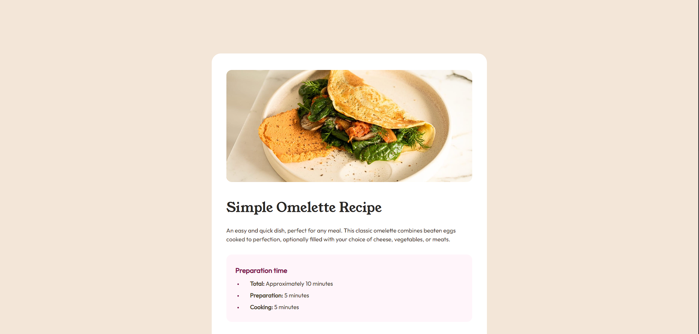

# Frontend Mentor - Recipe page solution

This is a solution to the [Recipe page challenge on Frontend Mentor](https://www.frontendmentor.io/challenges/recipe-page-KiTsR8QQKm). Frontend Mentor challenges help you improve your coding skills by building realistic projects.

## Table of contents

- [The challenge](#the-challenge)
- [Screenshot](#screenshot)
- [Links](#links)
- [Built with](#built-with)
- [Author](#author)

### Screenshot

### Links

- Solution URL: https://github.com/MohamedIbrahim24/Recipe-Page
- Live Site URL: https://mohamedibrahim24.github.io/Recipe-Page/

### Built with

- CSS custom properties
- Desktop-first workflow

## Author

- Frontend Mentor - [@MohamedIbrahim24](https://www.frontendmentor.io/profile/MohamedIbrahim24)
